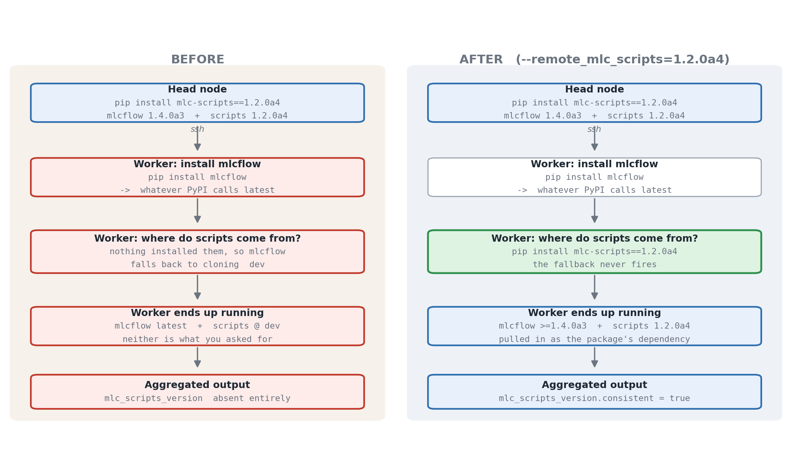
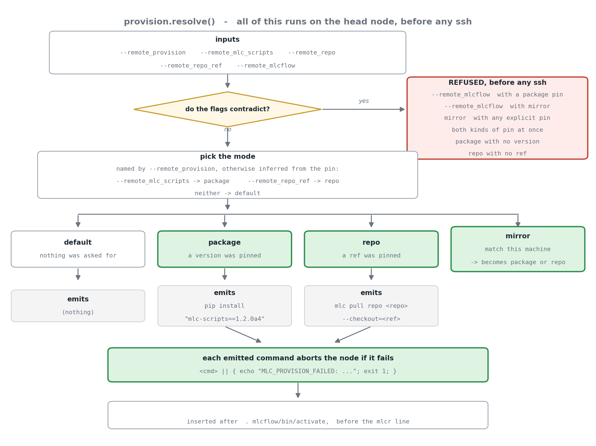
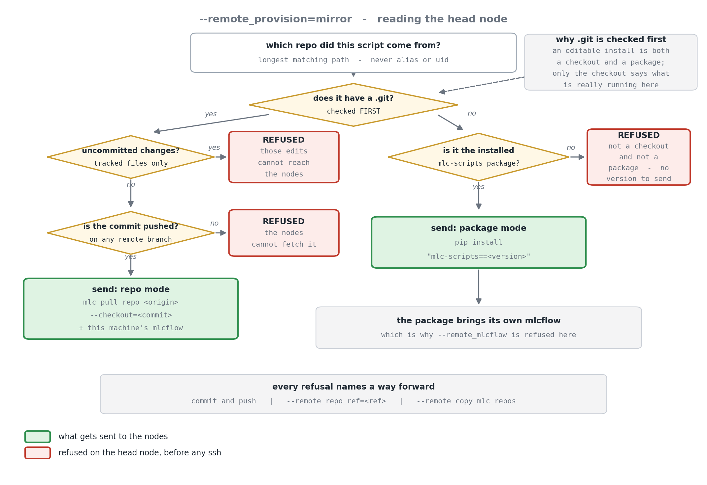
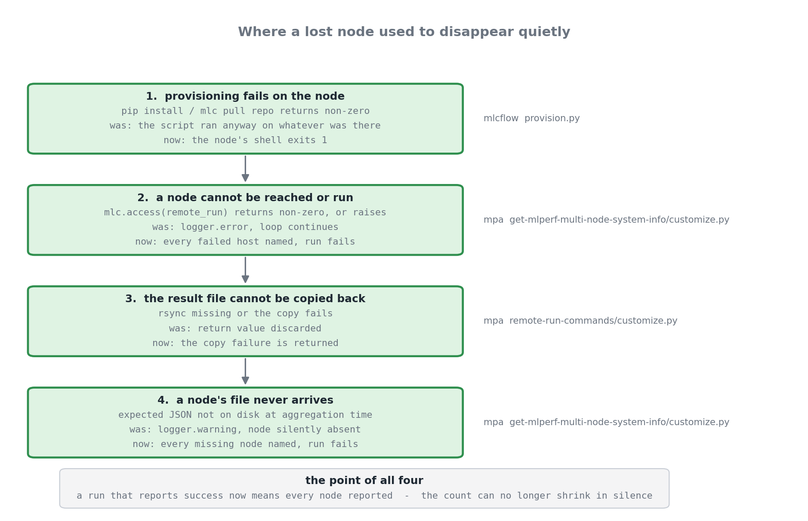

# Remote provisioning: the whole change

This is the record of one change, spanning two repositories, that lets the
caller say what a remote node should install before it runs a script.

For the underlying mechanics of remote-run itself, see
[Remote run: how a script reaches another machine](../targets/script/remote-run-flow.md).

---

## The problem

A submitter pins a build on the machine they are sitting at:

```bash
pip install mlc-scripts==1.2.0a4
mlcr get,mlperf,multi-node,system-info --ssh_ids=bench@node1,bench@node2 ...
```

The head node runs 1.2.0a4. The workers do not, and never did.



The reason is structural rather than a bug. The remote bootstrap installs
**mlcflow**, which is only the engine — it carries none of the ~378 scripts.
So when `mlcr` runs on the node there is nothing to run, and mlcflow falls
back to a hard-coded clone of `mlcommons@mlperf-automations` at branch `dev`.
Nothing about the head node influences that fallback.

We already had a safeguard for this. Each node stamps its output with the
version that produced it and the aggregator sets
`mlc_scripts_version.consistent`. On a pinned head node that flag was not
`false` — **it was absent**, because the version lookup understood only git
checkouts and a pip-installed head has no `.git`. The one check built for this
case was silent in it.

## The change in one sentence

Insert **one command** into the remote bootstrap, chosen by what the caller
asked for, and make a lost node fail the run instead of shrinking it.

## 1. Choosing what to install

`automation/script/provision.py` (new, self-contained) turns the flags into at
most two commands. It runs entirely on the head node — every rejection happens
before a connection is opened.



The mode is usually inferred, so most callers never type `--remote_provision`:

| You pass | The node runs |
|---|---|
| nothing | *nothing extra — unchanged* |
| `--remote_mlc_scripts=1.2.0a4` | `pip install "mlc-scripts==1.2.0a4"` |
| `--remote_repo_ref=<branch or commit>` | `mlc pull repo <repo> --checkout=<ref>` |
| `--remote_provision=mirror` | whichever of those describes this machine |

Three consequences worth knowing:

- **The installer is untouched.** No new installer flags, so no skew between
  the installer a node fetches and the code that generated the command.
- **In package mode nothing is cloned.** The wheel carries the scripts,
  mlcflow registers them, and the `dev` fallback never fires.
- **A pin works on a node that already ran.** `pip install pkg==X` moves an
  existing install, which matters because the node's virtualenv is reused
  between runs.

### Only one thing chooses the mlcflow version

`mlc-scripts` declares `mlcflow>=1.4.0a3` — a floor, not an exact version. Pin
both and pip does not complain; it installs a pairing nobody tested. So
`--remote_mlcflow` is refused where something else already decides:

| Mode | Who decides | `--remote_mlcflow` |
|---|---|---|
| package | the package's own metadata | rejected |
| mirror | this machine — its mlcflow is sent too | rejected |
| repo | nobody | accepted |
| default | nobody | accepted |

To pair a specific mlcflow with specific content, use `--remote_repo_ref`
together with `--remote_mlcflow`. That is the deliberate version of what the
rejected combination was reaching for.

## 2. What mirror reads



The ordering is the subtle part: **`.git` is checked before the package.** An
editable install is both a checkout and a package, and only the checkout
describes what the machine is actually running. Getting this backwards would
send nodes a completely different tree while reporting success.

Refusals are refusals, not warnings, and each names a way forward. A dirty
checkout cannot be reproduced on a node, so mirroring one would produce a
wrong answer rather than an error.

## 3. Making the version stamp work on a wheel

`get_repo_version()` read `.git` or `git_commit_hash.txt`. The mlc-scripts
wheel ships neither — it ships `.mlc-provenance.json`, written at build time.
Roughly ten lines in `mlc/utils.py` add it as a third source:

```json
{ "source": "package", "commit": "4a1b2c3", "version": "1.2.0a4",
  "branch": "", "dirty": false }
```

`branch` is empty because a wheel is not on one. `commit` is carried as well
as `version` because the aggregator's comparison key is `commit`: without it,
every packaged node would compare `None == None` and a fleet on *different*
versions would report `consistent: true`.

This does not make the nodes match. It is what lets us *show* that they do.

## 4. Failing loudly



A system description missing a node is not a partial answer, it is a wrong
one. Four places used to swallow that.

## Where it lives

**mlcflow**

| File | Change |
|---|---|
| `automation/script/provision.py` | new — modes, validation, mirror, command generation |
| `automation/script/remote_run.py` | one call, after venv activation |
| `mlc/utils.py` | `get_repo_version()` reads `.mlc-provenance.json` |
| `tests/test_remote_provision.py` | new — 38 tests |
| `.github/workflows/test-mlc-remote-run.yml` | provisioning cases over ssh-to-localhost |

**mlperf-automations**

| File | Change |
|---|---|
| `script/get-mlperf-multi-node-system-info/meta.yaml` | expose the flags, add a `tests:` block |
| `script/get-mlperf-multi-node-system-info/customize.py` | forward the flags; failed and missing nodes are fatal |
| `script/get-mlperf-multi-node-system-info/tests/` | new — 14 tests |
| `script/remote-run-commands/customize.py` | stop discarding copy failures |

## How it is tested

Three of the four layers need no second machine, and each reuses a harness
that already existed.

| Layer | What it proves | Where |
|---|---|---|
| generated commands | default is unchanged; each mode emits the right command; the rejection table | `tests/test_remote_provision.py` |
| mirror detection | packaged, git, editable-is-git, dirty, unpushed, neither | same file, reusing the fake-packaged-install fixture from `test_packaged_repo_guard.py` |
| aggregation | a missing node file fails and names it; versions that disagree report `consistent: false` | `get-mlperf-multi-node-system-info/tests/` |
| real provisioning | a pin reaches the node's virtualenv; re-pinning moves it; a bad ref fails the run | `test-mlc-remote-run.yml`, over ssh to localhost |

The fourth layer works on localhost because what is under test is *what lands
in the remote virtualenv*, and that is a real, separate virtualenv even on the
same machine.

**The acceptance check** is one line. From a head node running
`pip install mlc-scripts==1.2.0a4`, across two nodes with
`--remote_provision=mirror`:

```json
"mlc_scripts_version": { "consistent": true }
```

Before this change that block was absent entirely.

What still needs real hardware: a bare node where the installer must
sudo-install system packages, a heterogeneous mix of workers, a genuinely
unreachable host, and a macOS head node driving Linux workers.

## Deliberately not done

- **slurm.** `slurm_run.py` has the same bootstrap and gets no provisioning
  control. Adding it meant carrying a prefix argument and a "is failure fatal"
  flag through `provision.py` for a path nothing here exercises. Adding it
  later is a small change on a branch where slurm is the subject.
- **The installer's dead `pull_repo()`.** It has `--mlc-repo` and
  `--mlc-repo-branch` flags and a function to use them, and `main()` never
  calls it — while the README advertises "Cloning the automation repository".
  Issuing `mlc pull repo` directly means this change never depends on it.
  Worth its own fix.
- **Shipping the installer in the mlcflow wheel.** `docs/` is not packaged, so
  the air-gapped path (`--remote_no_internet`) has never worked for pip users.
  Independent of this change.
- **Comparing versions, not just commits.** `get_commit_hash()` falls back to
  the literal string `"unknown"`, so two wheels built without git metadata
  compare equal and pass. Comparing `version` as well would catch it.

## Diagrams

All four are generated, so they can be corrected rather than redrawn:

```bash
python3 docs/img/provisioning_diagrams.py   # the four on this page
python3 docs/img/remote_run_flow.py         # the end-to-end flow
```

Shared drawing helpers live in `docs/img/_flowlib.py`.
