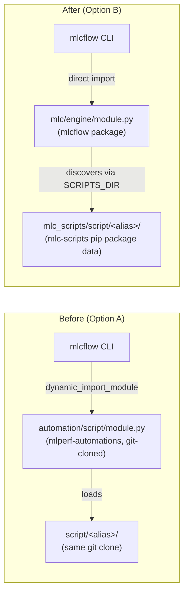

# Why Option B

mlcflow 2.0.0 and mlc-scripts 2.0.0 shipped a structural change nicknamed
"Option B" internally: the script execution engine moved out of
`mlperf-automations` and into `mlcflow` itself, and the ~378 individual
benchmark scripts started shipping as pip package data instead of a git-cloned
repository. This page explains why.

For the technical reference, see [Reference](reference.md). For hands-on
steps, see [Running remote/Docker without a clone](remote-and-docker.md) or
[Upgrading from pre-2.0 mlcflow](upgrading.md).

## The problem

Before this migration, `mlcflow` was a thin CLI that didn't contain any script
logic at all. When you ran `mlcr detect,os`, here's what actually happened:

1. `mlcflow` looked for a locally registered repo containing
   `automation/script/module.py` — the engine class, `ScriptAutomation`.
2. If it wasn't found, `mlcflow` **automatically ran `git clone` (or `git
   pull`)** of `mlcommons@mlperf-automations` — every time, silently, on
   whatever your local network happened to allow.
3. It then **dynamically loaded** `module.py` at runtime via
   `importlib.util.spec_from_file_location()`, prepending its directory to
   `sys.path` so the engine's own internal imports (`from utils import ...`)
   would resolve.

This worked, but it meant:

- **No offline installs.** A fresh `pip install mlcflow` was not enough to run
  anything — the first real command triggered an implicit network dependency
  on GitHub being reachable.
- **Implicit trust on every invocation.** Every `mlcr`/`mlcd`/`mlcrr` on a
  machine that didn't already have the repo cloned fetched and executed
  whatever was currently on the target branch — no version pin, no lockfile,
  no way to know in advance what code you were about to run.
- **The exact same problem, worse, over SSH.** `mlcrr`/`mlcre` (remote
  execution) had to replicate the entire clone-then-load dance on a **remote
  host you don't directly control the shell of** — the SSH bootstrap ran
  `pull_repo()` (a full `git clone`) on every single remote invocation,
  regardless of whether the remote already had a working copy.
- **One shared cache for every environment.** The cache and registered-repo
  list defaulted to a single, fixed `~/MLC/repos`, shared across every venv,
  every conda environment, and every project on the machine — so switching
  Python environments could silently reuse (or corrupt) cache entries meant
  for a completely different environment's dependency versions.
- **Container builds inherited all of the above.** Every generated Dockerfile
  cloned `mlperf-automations` at both build time and run time, even when the
  image had no plausible way to reach a private/local registry, and even when
  the script content was already available another way (local wheels, host
  mount).

## The approach

**Move the engine, not just relocate a config flag.** `ScriptAutomation` and
its supporting modules (`cache_utils.py`, `docker.py`, `remote_run.py`,
`experiment.py`, …) moved from `mlperf-automations/automation/script/` into
`mlcflow/mlc/engine/`, and `mlc/script_action.py` now does a plain, direct
`from mlc.engine import ScriptAutomation` at import time. No dynamic loading,
no `importlib.util.spec_from_file_location`, no auto-clone fallback to fall
back to.

**Ship script content as package data, not a git checkout.** The ~378 script
directories moved into a new package, `mlc-scripts`
(`mlc_scripts/script/**`), declared as `package-data` in `pyproject.toml`.
`pip install mlc-scripts` now bundles every `meta.yaml`, `customize.py`,
`run.sh`, and asset file a script needs — the same guarantee a wheel gives you
for any other Python dependency. `mlcflow` discovers this content by
registering the installed package as a synthetic, read-only repo
(`_get_package_scripts_repo()` in `action.py`) — see
[Reference](reference.md#how-mlcflow-discovers-mlc-scripts-content) for the
mechanism.

**Make the remote/Docker "no clone" guarantee real, not just implied.** The
SSH bootstrap now runs `pip install -U mlc-scripts` on the remote instead of
cloning; the installer's own `pull_repo()` step flipped from opt-out to
opt-in (`--pull-repo`); generated Dockerfiles skip `RUN mlc pull repo` and
`git clone` entirely whenever `mlc-scripts` is one of the image's installed
Python packages.

**Anchor the cache to the active environment, not a fixed home-directory
path.** `MLC_REPOS` unset now resolves to `{sys.prefix}/mlc_cache` inside an
active venv, or `{CONDA_PREFIX}/mlc_cache` inside a named conda environment,
falling back to the pre-migration `~/MLC/repos` only outside of both. Each
environment gets its own cache and registered-repo list; nothing is shared
unless you explicitly set `MLC_REPOS` to force it.

**Never break an already-published script.** Roughly 190 existing
`customize.py` files rely on `from utils import ...` resolving via the old
loader's `sys.path` trick. Rather than requiring every script author to
rewrite their imports, `mlc/engine/__init__.py` re-exposes the engine's
internal utils module as a top-level `utils` module — so every script that
worked before the migration keeps working, unmodified, after it.

## Trade-offs

Every design choice here traded something away:

- **Bundled package wins on a UID clash (default).** A registered local repo
  with the same script UID as a bundled one used to silently take priority
  (arguably "correct" for active development, but also exactly how a stale
  clone from the old auto-clone flow could quietly shadow a fresh install).
  Now the bundled package wins by default, and active script development
  requires an explicit opt-in (`MLC_PREFER_DEV_SCRIPTS=1`). Cost: one more
  env var for contributors actively iterating on scripts to remember.
- **Venv/conda-anchored cache by default is a bigger behavioral change than
  it looks.** Someone upgrading `mlcflow` inside an environment they'd used
  before this default changed will get a brand-new, empty cache unless they
  notice the one-time warning and set `MLC_REPOS` back to their old path.
  We chose to warn rather than silently migrate data, because silently
  moving or duplicating potentially multi-GB cache directories on someone's
  disk without asking felt like the riskier default.
- **The remote bootstrap still fetches unpinned code.** The SSH bootstrap
  script itself (`mlcflow_unix_installer.sh`) is still fetched via
  `curl .../refs/heads/dev/...sh | bash` by default (no version pin, no
  checksum) unless you pass `--remote_local_installer_path` — so "no more
  implicit git-clone trust" is true for script *content*, but the installer
  fetch itself is a similar-shaped risk that wasn't eliminated, only moved.
  This is a known, accepted gap for now, not an oversight.
- **Docker's `MLC_DOCKER_NOT_PULL_UPDATE=True` override can't currently be
  disabled per-invocation** for a caller who explicitly wants the repo pulled
  at runtime even though `mlc-scripts` is pip-installed in the image — the
  CLI input and the engine's already-merged env aren't distinguishable at the
  point `customize.py`'s `preprocess()` runs. `MLC_DOCKER_HOST_MLC_REPOS` and
  `MLC_REPO_PATH` remain the functional escape hatches for that case.

## Alternatives considered

- **Keep the dynamic loader, just change what it points at.** Rejected: this
  would have kept the implicit-trust and offline-install problems, just
  aimed at a pip-installed location instead of a git clone — most of the
  actual risk this migration removes would have remained.
- **Vendor the ~378 scripts directly inside `mlcflow`.** Rejected: scripts and
  engine have very different release cadences (new benchmark scripts land
  far more often than engine changes), and MLCommons wanted `mlc-scripts` to
  stay independently versionable and installable without forcing an engine
  upgrade.
- **Drop backward compatibility for the `utils` import pattern** and require
  every script to update its imports. Rejected outright — this would have
  broken all ~190 affected scripts simultaneously on upgrade, for a
  cosmetic import-style difference with no functional benefit.
