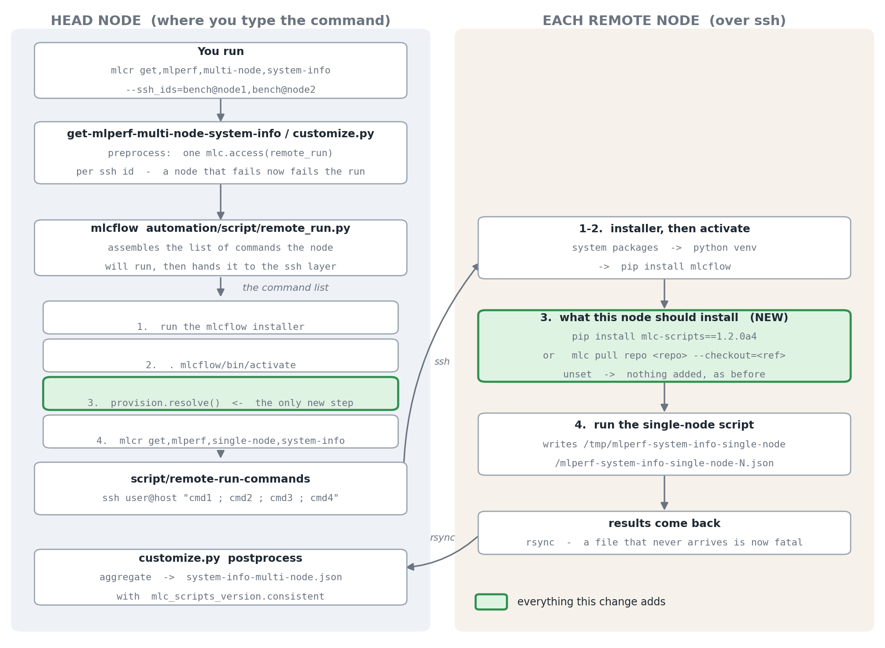

# Remote run: how a script reaches another machine

`mlc remote-run` (and `mlcrr`) runs an MLC script on another machine over ssh.
The multi-node system-info script is the heaviest user of it: it calls
remote-run once per node and then stitches the answers together.

This page describes what actually happens, end to end, and where the remote
provisioning options fit.



*Regenerate the diagram with `python3 docs/img/remote_run_flow.py`.*

## The flow, step by step

### On the head node

**1. You run the script.**

```bash
mlcr get,mlperf,multi-node,system-info \
  --ssh_ids=bench@node1,bench@node2 \
  --system_name=my-cluster
```

**2. The script fans out.** `get-mlperf-multi-node-system-info/customize.py`
splits `--ssh_ids` and, in `preprocess`, makes one call per node:

```python
mlc.access({'action': 'remote_run', 'tags': 'get,mlperf,single-node,system-info',
            'remote_host': host, 'remote_user': user, 'remote_port': port, ...})
```

Nodes are handled one at a time, in order. Node ids are positional: the local
machine is node 0 and the ssh ids become 1, 2, 3 in the order given.

**3. mlcflow builds the command list.** `automation/script/remote_run.py` does
not connect to anything. It builds a list of shell commands the node will run:

| | Command | Where it comes from |
|---|---|---|
| 1 | `curl -sSL .../mlcflow_unix_installer.sh \| bash -s -- --yes --venv-dir mlcflow` | `remote_run.py` |
| 2 | `. mlcflow/bin/activate` | `remote_run.py` |
| 3 | *the provisioning command, if any* | `provision.resolve()` |
| 4 | `mlcr get,mlperf,single-node,system-info ...` | `regenerate_script_cmd()` |

Step 4 is the original command rebuilt for the remote. Every `remote_*` input
is stripped out first (`prune_input`), so the node never sees flags meant for
the orchestration.

**4. The ssh layer sends it.** `script/remote-run-commands` joins the list with
`;`, quotes it, and runs:

```
ssh -p 22 -i ~/.ssh/id_rsa bench@node1 'cmd1 ; cmd2 ; cmd3 ; cmd4'
```

### On each remote node

**Steps 1-2 — the installer.** Installs missing system packages (needs sudo),
creates or reuses a virtualenv at `~/mlcflow`, and `pip install mlcflow`. An
existing compatible venv is reused between runs.

**Step 3 — provisioning.** See below. Absent unless you asked for it.

**Step 4 — the script runs** and writes
`/tmp/mlperf-system-info-single-node/mlperf-system-info-single-node-N.json`.

### Coming back

`remote-run-commands`' `postprocess` pulls each named file back with
`rsync -avz -e ssh`, into the head node's output directory. The `-N` suffix is
what keeps the nodes' files apart.

The multi-node script's `postprocess` then reads every expected file, merges
identical nodes into one node type with a count, and writes
`system-info-multi-node.json`.

## Where the script content comes from

This is the part worth understanding, because it is the reason the
provisioning options exist.

Step 1 installs **mlcflow**. mlcflow is the engine — it does not contain any
of the ~378 scripts. So at step 4 the node has `mlcr` but nothing to run.

mlcflow handles that with a fallback in `mlc/script_action.py`: if no
registered repo has script content, it clones `mlcommons@mlperf-automations`
at branch **`dev`** and carries on. That is a hard-coded branch, and nothing
about the head node influences it.

The consequence: **the head node's version has no bearing on what the nodes
run.** If you pinned `mlc-scripts==1.2.0a4` locally, the nodes still get
tip-of-tree `dev`, and the aggregated output is a blend of two versions.

## Telling the nodes what to install

One extra command, chosen from what you passed:

| You pass | Command 3 becomes |
|---|---|
| nothing | *(nothing - unchanged behaviour)* |
| `--remote_mlc_scripts=1.2.0a4` | `python3 -m pip install "mlc-scripts==1.2.0a4"` |
| `--remote_repo_ref=<branch or commit>` | `mlc pull repo <repo> --checkout=<ref>` |
| `--remote_provision=mirror` | whichever of those describes this machine |

Also `--remote_mlcflow=<version>` to pin mlcflow itself, and `--remote_repo`
to name a repo other than `mlcommons@mlperf-automations`.

Two details that follow from the mechanism:

- In the package case nothing needs to be cloned. The wheel carries the
  scripts, mlcflow registers them on the next command, and the `dev` fallback
  stops firing because content is now present.
- `pip install mlc-scripts==X` moves an existing install to X, so a pin works
  on a node that already ran at a different version. That matters because the
  virtualenv is reused.

Each provisioning command is written so a failure aborts the node's shell:

```
python3 -m pip install "mlc-scripts==1.2.0a4" || { echo "MLC_PROVISION_FAILED: ..."; exit 1; }
```

Without that, a failed install would fall through to step 4, the node would
run whatever content it already had, and the run would report success.

### Only one thing chooses the mlcflow version

`mlc-scripts` declares `mlcflow>=1.4.0a3` — a floor, not an exact version. So
pinning both would not conflict in pip; it would quietly install a pairing
nobody tested. `--remote_mlcflow` is therefore refused where something else
already decides:

| Mode | Who decides | `--remote_mlcflow` |
|---|---|---|
| package pin | the package's own metadata | rejected |
| mirror | this machine - its mlcflow is sent too | rejected |
| repo ref | nobody | accepted |
| default | nobody | accepted |

To pair a specific mlcflow with specific script content, use
`--remote_repo_ref` together with `--remote_mlcflow`.

### What mirror reads

`--remote_provision=mirror` looks at the repo the running script came from:

- **a git checkout** - sends that repo and commit, plus this machine's mlcflow
  version. Checked *before* the package case, because an editable install is
  both and only the checkout describes what is actually running.
- **a pip install** - sends that version.
- **uncommitted changes** - refused. They cannot reach the nodes, and
  pretending otherwise gives a wrong answer instead of an error. Use
  `--remote_copy_mlc_repos` to copy the tree as it is.
- **a commit no remote has** - refused, checked before connecting.

## Did it work?

The aggregated output carries the version every node reported:

```json
"mlc_scripts_version": {
  "repo": "mlc_scripts",
  "source": "package",
  "commit": "4a1b2c3...",
  "version": "1.2.0a4",
  "branch": "",
  "dirty": false,
  "consistent": true,
  "nodes": { "0": { "source": "package", "commit": "4a1b2c3...", ... } }
}
```

`source` is `git` for a checkout, `package` for a wheel. `version` appears
only for a wheel; `branch` is empty there, because a wheel is not on one.

`consistent` is true only when every node reported a version and all of them
match the head node. It is the single check worth looking at after a
multi-node run.

## Things that will trip you up

- **The venv path is relative.** `--venv-dir mlcflow` resolves against the ssh
  login directory, normally `$HOME`.
- **Node ids are positional.** The returned JSON records no hostname, so a
  file is tied to a host only by the order of `--ssh_ids`.
- **The installer needs sudo** on a node missing python, git, curl or unzip.
- **Two mlcflow copies exist.** `mlperf-automations` keeps its own
  `automation/` directory, but a bundled mlcflow always loads its own. Edits
  to the copy in `mlperf-automations` are invisible. See `AGENTS.md`.
- **Provisioning targets the host, not a container.** With
  `--remote_action=docker` the image is unaffected, and `consistent` will not
  catch a stale one.
